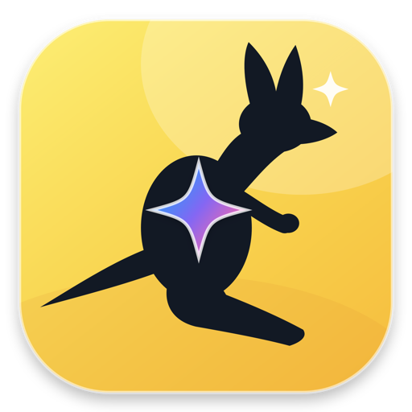

<p align="center">
  
</p>

<h1 align="center">ZCode Antigravity</h1>

<p align="center">
  <strong>把 Gemini 与可选的 Grok 接入 ZCode 和更多 Agent / CLI，并在桌面直接查看额度、Token 与连接状态。</strong>
</p>

<p align="center">
  
  
  
  
</p>

<p align="center">
  <a href="https://github.com/Hhz0823/ZCode-Antigravity/releases/tag/v1.0.0"><strong>下载 V1.0.0 正式版</strong></a>
  · <a href="#快速开始">快速开始</a>
  · <a href="#一键接入-agent--cli">Agent 接入</a>
  · <a href="#隐私与安全">安全边界</a>
</p>

ZCode Antigravity 是面向 Windows 与 macOS 的本地 AI 控制中心。它负责账号授权、模型路由、
ZCode / Agent 配置、额度监控与网络出口选择；默认只启用 Gemini，需要时可在设置中开启 Grok
和其他文本模型。

## 核心功能

| 功能 | 能做什么 |
| --- | --- |
| **Gemini 优先，Grok 可选** | 默认只向客户端暴露 Gemini；Grok / xAI 与其他文本模型按需开启，账号、额度和路由互不混淆。 |
| **原生 Google 联网搜索** | 独立的 `gemini-web-search` 模型调用 Antigravity 原生 Google Search，返回网页引用和可检查的搜索请求数据。 |
| **多模态输入** | 支持文本、图片、音频和视频输入转换；当前 Gemini 3.7 Flash 输出为文本。 |
| **一键接入更多 Agent** | 自动备份并合并 ZCode、DeepSeek Harness、Grok Build、Codex、Claude Code、Gemini CLI、Qwen Code、Kimi Code 与 OpenCode 配置。 |
| **无需强制开启 TUN** | Windows 自动使用系统代理或运行中的 v2rayN mixed / HTTP 代理，均不可用时才直连；手动代理始终优先。 |
| **额度与 Token 小组件** | macOS 菜单栏和 Windows 系统托盘直接查看 5 小时 / 本周额度、重置时间、最近输出 Token、推理 Token 与 Token/s。 |
| **本地安全边界** | API、OAuth 回调和管理接口只监听 `127.0.0.1`；配置写入前自动备份，凭据使用系统安全能力加密。 |
| **双平台精美界面** | macOS 使用 SwiftUI + AppKit 原生界面，Windows 使用 Electron + React + Tailwind；背景玻璃化，内容层保持高对比度。 |

## 模型与联网能力

默认的 Antigravity 模型：

- `gemini-3.8-flash`：最新一代通用对话、编程与多模态理解。
- `gemini-3.7-flash`：通用对话、编程与多模态理解。
- `gemini-3.6-flash`：兼容模型。
- `gemini-web-search`：界面显示为 **Gemini Web Search (Google)**，固定走原生 Google Search 并返回来源引用。

普通 Gemini 模型不会因为提示词中写了“搜索”就伪装成已联网。需要最新网页信息时，请明确选择
`Gemini Web Search (Google)`。Grok 和其他 AI 文本模型默认关闭，可在“设置 → 模型”中开启并重新同步；
图片 / 视频生成模型不会混入文本模型列表。

## 一键接入 Agent / CLI

| 客户端 | 接入方式 | 说明 |
| --- | --- | --- |
| ZCode | 一键写入 Provider | Provider 显示为简洁的 `Google`，内部兼容 ID 保持稳定。 |
| DeepSeek Harness | 一键合并配置 | 保留已有 Provider，并在修改前创建备份。 |
| Grok Build | 一键合并配置 | 可连接 Antigravity 或已启用的 Grok。 |
| OpenAI Codex | 一键写入自定义 Provider | 使用本机 OpenAI 兼容网关。 |
| Claude Code | 一键写入 LLM Gateway | 使用本机 Anthropic 兼容网关。 |
| Gemini CLI | 一键写入原生 Gemini 端点 | 仅在 Antigravity 提供商下启用。 |
| Qwen Code / Kimi Code | 一键合并配置 | 不删除用户已有配置。 |
| OpenCode | 一键合并 Provider | 可随当前提供商同步模型。 |

程序只管理自己创建的配置项，并会在覆盖前创建有上限的备份。通用 OpenAI / Anthropic 客户端也可从
“Agent 接入”页复制当前本地配置。

## 下载

前往 [V1.0.0 正式版 Release](https://github.com/Hhz0823/ZCode-Antigravity/releases/tag/v1.0.0) 下载：

| 文件 | 用途 | 推荐场景 |
| --- | --- | --- |
| `ZCode-Antigravity-macOS-Universal-v1.0.0.zip` | macOS Universal App 与校验 / 维护工具 | macOS 用户首选 |
| `ZCode-Antigravity-Setup-v1.0.0.exe` | Windows 图形化安装器 | Windows 用户首选 |
| `ZCode-Antigravity-OneClick-v1.0.0.bat` | 内嵌完整载荷的单文件安装器 | 备用安装方案 |
| `ZCode-Antigravity-Windows-x64-1.0.0.zip` | 可逐文件校验的 Windows 便携包 | 手动部署与排错 |
| `ZCode-Antigravity-Source-v1.0.0.zip` | 与发布标签对应的源码快照 | 审计与二次开发 |
| `SHA256SUMS-v1.0.0.txt` | 全部正式版资产的 SHA-256 | 下载后完整性校验 |

## 快速开始

### macOS

1. 完整解压 Universal ZIP，在 `Terminal Tools` 中运行 `Verify-Package.command` 校验安装包。
2. 首次运行时按住 Control 点击 `ZCode Antigravity.app` 并选择“打开”。当前 App 使用临时签名，尚未公证。
3. 登录 Antigravity，点击“一键接入 ZCode”，然后完全退出并重新打开 ZCode。
4. 在 ZCode 中选择 Provider `Google` 和目标 Gemini 模型；需要联网时选择 `Gemini Web Search (Google)`。

关闭主窗口后，菜单栏仍会保留一个小图标。单击即可查看额度与 Token 小组件，再点窗口外部会自动收起。

### Windows

1. 从系统托盘完全退出 ZCode；仅关闭主窗口可能仍会留下 `ZCode.exe`。
2. 校验 SHA-256 后运行 `ZCode-Antigravity-Setup-v1.0.0.exe`。当前安装器未使用商业代码签名证书。
3. 登录 Antigravity 并点击“一键接入 ZCode”。程序会自动探测 Windows 系统代理与 v2rayN，无需强制开启 TUN。
4. 重新打开 ZCode，选择 Provider `Google` 和目标模型；系统托盘图标可随时打开额度小组件。

如需 Grok，在设置中启用 Grok 后完成 xAI 设备授权。Windows 会在软件内显示临时验证码；把它输入官方
授权页后，程序会自动轮询授权结果，无需粘贴回调内容。

## 网络出口与本地端口

| 服务 | 默认地址 | 端口占用时 |
| --- | --- | --- |
| 本地模型网关 | `127.0.0.1:18080` | 自动扫描 `18081–18180` |
| OAuth callback | `127.0.0.1:51121` | 自动扫描 `51122–51221` |
| 控制中心 | `127.0.0.1:18200–18250` | 在范围内选择可用端口 |

Windows 自动网络顺序为：手动 `proxyURL` → 当前用户系统代理 → v2rayN mixed / SOCKS5
`127.0.0.1:10808` → 旧版 HTTP `10809` → 直连。macOS 可使用系统 TUN、`HTTP_PROXY` /
`HTTPS_PROXY`，或 App 资源中的 `settings.json`。所有代理均应指向可信的本机服务。

## 额度、Token 与状态栏小组件

- Antigravity 展示 5 小时和每周剩余额度；Grok 展示上游 Grok Build billing 返回的共享周期额度。
- 额度每 5 分钟自动刷新，手动刷新、切换提供商和完成接入会立即刷新；失败时保留上次成功数据。
- Token 统计来自本地网关真实 usage，显示最近输出、推理 Token、生成速度和本地累计输出。
- 不保存提示词或模型回复。上游未提供某类额度时会明确显示“未提供”，不会用本地 Token 估算账号余量。

## 隐私与安全

- API、OAuth callback 与管理路由只监听 loopback，不开放远程管理。
- Windows 使用当前用户 DPAPI 保护 OAuth token；macOS 使用登录钥匙串中的随机主密钥进行 AES-256-GCM 加密。
- ZCode 配置只保存随机本地网关密钥，不写入 Google / xAI token。
- 修改 ZCode 或 Agent 配置前自动备份；停止 Bridge 不会删除账号或聊天记录。
- 发布包不包含 OAuth token、账号 JSON、本地 API key、日志或用户的 ZCode 配置。
- 背景模糊由系统 / Electron 合成器完成，程序不会读取、缓存或上传窗口后方像素。

## 已验证范围

V1.0.0 正式版发布流程包括：

- 管理器与固定 CLIProxyAPI 源码的 Go 测试、`go vet` 与依赖校验。
- macOS arm64 / x86_64 类型检查、Universal 构建、签名结构、包内哈希和本机启动 / 网关健康检查。
- Windows x64 Go 交叉编译、Electron IPC allowlist 测试、前端生产构建、ASAR 内容与 PE32+ GUI 子系统检查。
- OAuth PKCE / callback、加密存储、模型路由、额度降级、双提供商切换和八类 Agent 配置回归测试。
- Gemini 文本、Google Search 引用、图片理解和视频时序理解的既有真实账号验证。

Windows 正式包由 macOS 交叉构建并完成静态与自动化验证；发布时未冒充新的 Windows 目标机实测。
macOS Intel 切片完成交叉编译和结构校验，但尚未完成 Intel 实机启动测试。详细记录见
[`VERIFICATION.md`](VERIFICATION.md)。

## 从源码构建

源码包含 SwiftUI / AppKit macOS 客户端、Electron / React Windows 客户端、Go 本地 Core、测试、
固定的 CLIProxyAPI v7.2.132 源码与可重放补丁。GitHub 源码不内置 Google OAuth 桌面应用凭据；
开发者需要使用自己有权使用的配置：

```bash
export ANTIGRAVITY_OAUTH_CLIENT_ID='<your-client-id>'
export ANTIGRAVITY_OAUTH_CLIENT_SECRET='<your-client-secret>'
```

macOS Universal 构建：

```bash
cd project/packaging/macos
./Build-Universal.sh
```

Windows Electron UI 构建：

```bash
cd project/native/windows/ui
npm ci
npm run test:electron
npm run package:windows
```

构建脚本默认拒绝生成缺少 OAuth 配置的可登录发布包。开发规范和提交要求见
[`CONTRIBUTING.md`](CONTRIBUTING.md)。

## 常见问题

### 为什么 Gemini 没有联网搜索？

普通 Gemini 3.7 / 3.6 是对话模型。请在客户端明确选择 `Gemini Web Search (Google)`；若升级后看不到，
完全退出 ZCode，回到控制中心点击“修复并重新同步”。

### 为什么显示 401、403、429 或模型不可用？

先确认当前提供商、账号授权和网络出口。403 / 429 通常属于上游资格、风控或额度边界；本项目不会绕过验证。

### 为什么系统提示未知发布者？

当前 Windows 安装器未使用商业代码签名，macOS App 使用临时签名且未公证。请先核对 Release 中的
`SHA256SUMS-v1.0.0.txt`，哈希完全一致后再运行；不要全局关闭系统安全机制。

## 商标与免责声明

黄色袋鼠与渐变四芒星为本项目原创组合标识，并非美团、Google 或 xAI 官方联合标识。相关名称和商标
归各自权利人所有。本项目仅用于研究、开发与测试，使用者应自行确认服务条款、账号政策、网络规则和
当地法律要求，并承担使用未公开接口可能带来的兼容性与账号风险。
